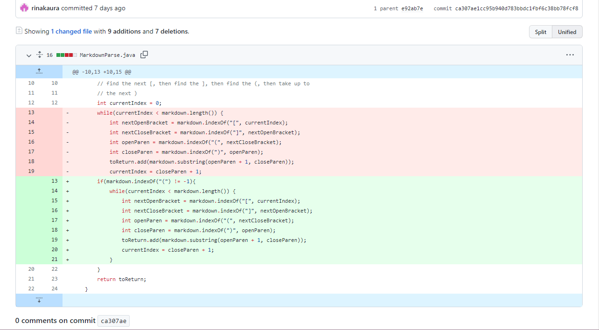
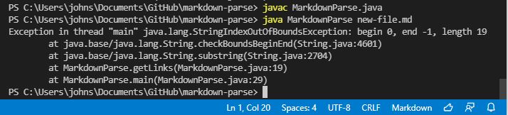
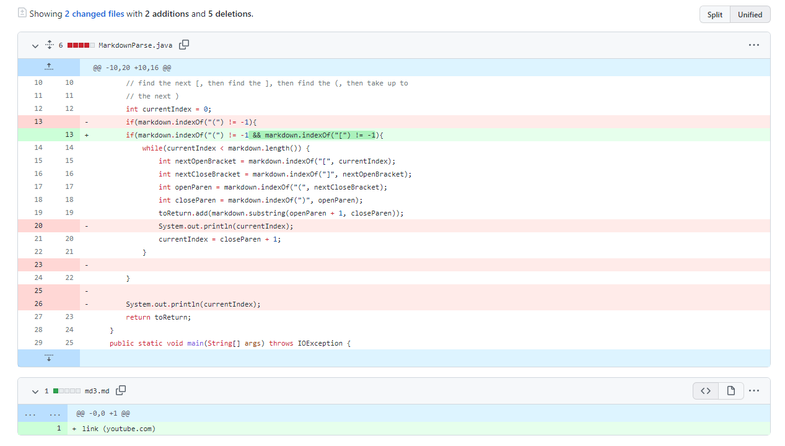
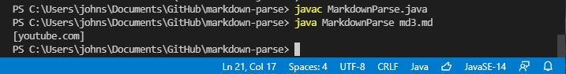
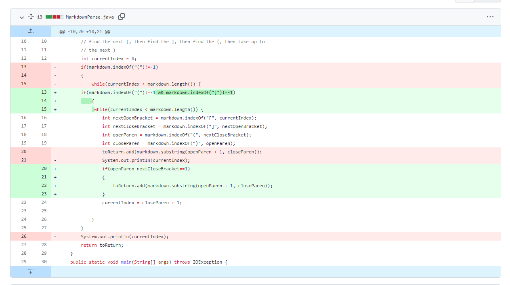
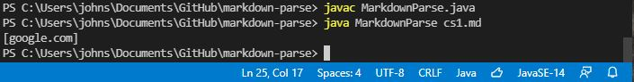

# Lab-Report-2
**Name:Junpeng Li**
>
**Professor Joe**
>
**Date:01/27/2022**
>
**CSE 15L**
>
*In this lab report, I will introduce the three types of code changes in the `MarkdownParse.java` file in particular to resolve three different issues*
>
# Test 1 with no parenthesis in the link format
___

>
Link to the test file for a failure-inducing input:
[failure-inducing input test-file](https://github.com/rinakaura/markdown-parse/blob/main/new-file.md)
>
## The symptom of this failure-inducing input:
**Screenshot of the Symptom**:
>

>
```
Exception in thread "main" java.lang.StringIndexOutOfBoundsException: begin 0, end -1, length 20
        at java.base/java.lang.String.checkBoundsBeginEnd(String.java:3756)
        at java.base/java.lang.String.substring(String.java:1902)
        at MarkdownParse.getLinks(MarkdownParse.java:18)
        at MarkdownParse.main(MarkdownParse.java:26) 

```
___
>
Literally, the failure-inducing input `[a link!] google.com` has no parenthesis in the link format which will cause the line ` toReturn.add(markdown.substring(openParen + 1, closeParen));`to have a index out of bound bug because the index of *openParen* and *closeParen* are *-1*. Therefore, as long as the user complies and runs the java file with this failure-inducing input, an symptom called *StringIndexOutOfBoundException* will be thrown out.
>
The way to fix this bug is to check the comparision before running the while loop.For instance, if the index of the open-parenthesis is not -1 which typically means it exists in the test file, the while loop will run.
>
___
# Test 2 with no brackets in the link format:
___
*Code editing for solving the issue:*
>

>
[Link with parenthesis but no bracket](https://github.com/lhailani/markdown-parse/blob/main/md3.md)
>
## Output symptom:
**ScreenShot of the Symptom**:
>

___
```
[youtube.com]
```
>
In particular, the output should be an empty list if the link is not in the correct format.The failure-inducing input`link (youtube.com)` would make the program have a bug like it can still run normally without the bracket and printing out the link as long as the link is inside the parenthesis. The symptom will correspondingly relate to the bug because since the bug allows the program to run normally, the output will still come out with a link.
>
Instead, what our group have done is to add one more conditions to make the program not run the loop without both the bracket and parenthesis within the link format.

# Code Change for Test case 3 where the link is in correct format but the parenthesis
*The way to resolve this issue*
>

>
___
[link with correct format but the parenthesis after the bracket is far away](https://github.com/johnsonli010801/markdown-parse/edit/main/cs1.md)
>
**The file show the failure-inducing input as normal input, we have to click on edit on the link above in order to see what's the difference between this one with the actual correct one. This one should contain some spaces after the close bracket and before the open parenthesis**
>
___
## Symptom output:
**ScreenShot of the Symptom**:
>

___
```
[google.com]
```
>
___
For this failure-inducing input `[a link]                                                                      (google.com)`, there exists space between the closed bracket and the open parenthsis which is literally the incorrect format of the link or the bug. Normally if we did not modify the code, the program can still consider the input as the correct format of link,and it will compile and run the program then output as a correct link with this particular bug. This bug which is from the failure-inducing input relatively caused the symptom to output as a correct link.
Actually, the correct format of link should be no space after the closed bracket and before the open parenthesis.
>
 In order to change the code to let the program consider this bug as an error to stop running the loop, we can add the condition to check the difference of index of closed bracket and open parenthesis that whether it is equal to 1. If not, then the program should consider this bug and stop the loop and return the empty list as the correct output.
 >
 ___

**Thank you for reading this lab report**
